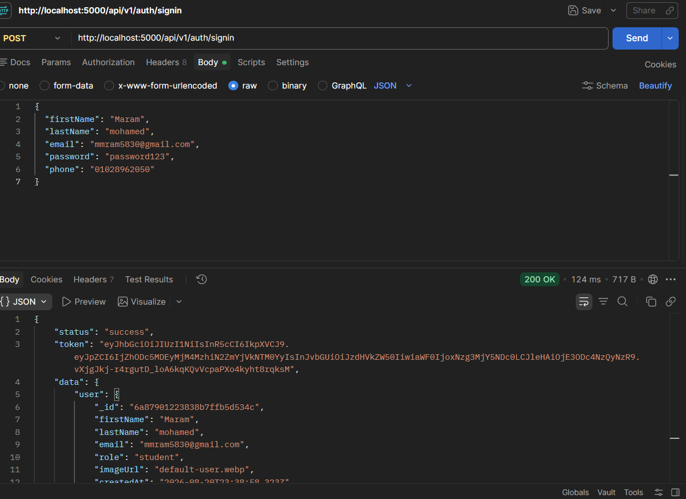
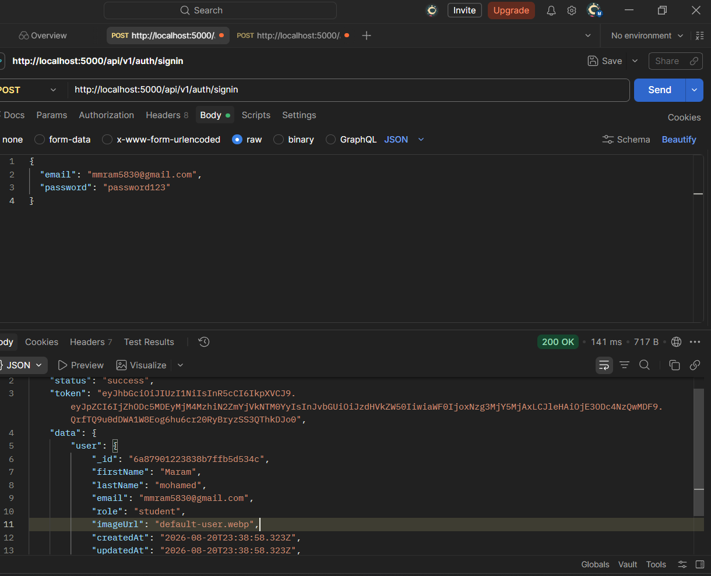

# Bookify Backend

## Project Description

Bookify is a backend API for managing books, user authentication, and role-based authorization. The project provides CRUD operations for books, image uploading using Multer, and a complete authentication and authorization system using JWT, bcryptjs, and custom protection middleware.

## Features

* Create a new book
* Get all books
* Get a single book by ID
* Update a book
* Delete a book
* Upload a book image using Multer
* Store the uploaded image path with the book data in MongoDB
* Serve uploaded images through the API
* User registration (Sign up) with automatic password hashing using bcryptjs
* User login (Sign in) with JWT token generation
* Route protection using Authentication Middleware to verify JWT tokens
* Role-based access control (Admin and Student roles)

## Technologies Used

* Node.js
* Express.js
* MongoDB
* Mongoose
* Multer
* bcryptjs
* jsonwebtoken (JWT)
* Nodemon
* dotenv

## Project Structure

The main project contains the following important files and folders:

* `index.js` — Main server file and API routes
* `models/bookModel.js` — Book database model
* `models/userModel.js` — User database model
* `controllers/auth-controllers.js` — Authentication logic (signup & signin)
* `routes/auth-routes.js` — Authentication endpoints
* `middleware/authenticate-middleware.js` — Verifies JWT tokens and protects private routes
* `middleware/authorize-middleware.js` — Restricts access based on user roles
* `utils/get-jwt.js` — JWT token generator helper
* `uploads/` — Stores uploaded images
* `package.json` — Project dependencies and scripts
* `.env` — Environment variables

## How to Run the Project

1. Open the project folder in the terminal.
2. Install the project dependencies using `npm install`.
3. Make sure MongoDB is available locally or via your connection string.
4. Create a `.env` file in the root directory and add your environment variables:
   ```env
   PORT=5000
   MONGO_URI=mongodb://127.0.0.1:27017/bookify
   JWT_SECRET=your_super_secret_key
   JWT_EXPIRES_IN=7d
Start the server using node index.js or npm run dev.

The API runs on port 5000 by default.

API Usage
1. Authentication Endpoints (Session 16)
Register a New User (Sign Up)
Endpoint: POST /api/v1/auth/signup

Body (JSON):

JSON
{
  "firstName": "Maram",
  "lastName": "mohamed",
  "email": "mmram5830@gmail.com",
  "password": "password123",
  "phone": "01028962050"
}
Description: Registers a new user with a default student role, hashes the password, saves it to MongoDB, and returns a JWT token.

User Login (Sign In)
Endpoint: POST /api/v1/auth/signin

Body (JSON):

JSON
{
  "email": "mmram5830@gmail.com",
  "password": "password123"
}
Description: Authenticates user credentials, validates the hashed password, and returns a new JWT token.

2. Protecting Routes & Authorization
To access protected routes, include the JWT token in the request headers:

HTTP
Authorization: Bearer <your_token>
Access is restricted based on user roles (admin or student).

3. Book Endpoints
Create a Book
Endpoint: POST /books

Description: Send a POST request using multipart/form-data containing the book title, description, price, category, and an image file (under the field name image).

Get All Books
Endpoint: GET /books

Description: Retrieves all books stored in the database.

Get One Book
Endpoint: GET /books/:id

Description: Retrieves a specific book by providing its ID.

Update a Book
Endpoint: PATCH /books/:id

Description: Updates specific book information or replaces its image.

Delete a Book
Endpoint: DELETE /books/:id

Description: Deletes a specific book and removes its image from the local storage.

File Upload
Images are uploaded using Multer. The uploaded file is saved inside the uploads/ folder, and its path is stored with the corresponding document in MongoDB.

User Roles
The application supports the following user roles defined in the User model:

student (Default)

admin

Server
The backend server runs on port 5000 by default.
Base URL: http://localhost:5000

### 1. Signup Response (201 Created)


### 2. Signin Response (200 OK)
